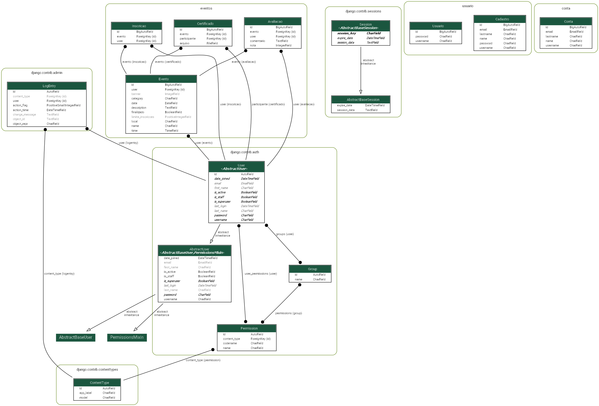

# EV+: Sistema para Gerenciamento de Eventos

O EV+ é um sistema projetado em Django (python + html) e com objetivo de organização, criação e divulgação de eventos.

## 📜 Documentação
- [PDF]()

## 📌 Requisitos 
- [Funcionais]()
- [Não Funcionais]()

## 📉 Diagrama de Classe

## 📈 Diagramas de Caso de Uso

## 📊 Diagramas de Sequência

## 🤓 Membros
  - Denylson de Freitas Feitoza
  - Francisco Ruan Mendes Costa
  - Gessica Mayara da Silva Andrade
  - Rafaela Queiroz de Souza

## 👨‍🏫 Professor
  - Jose Ferdinandy Silva Chagas
